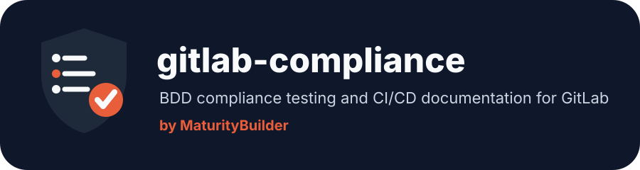
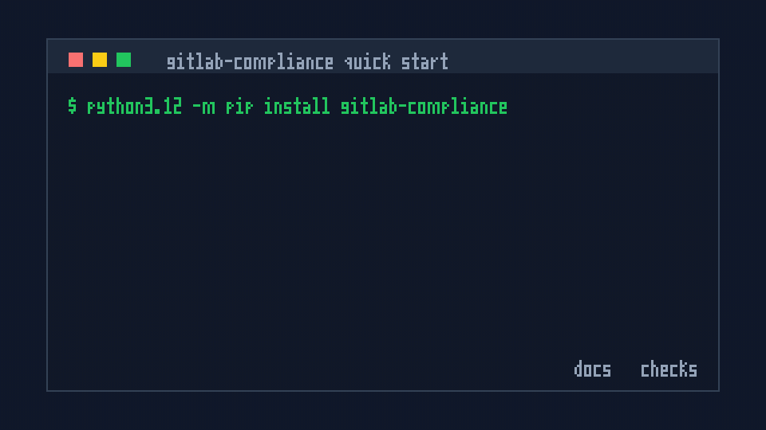

{ .mb-hero-image }

# GitLab Compliance

`gitlab-compliance` is a lightweight command-line toolkit for GitLab CI/CD
security controls. It runs readable Gherkin policies against `.gitlab-ci.yml`,
can enrich checks with GitLab API settings, and can generate pipeline reference
documentation from the same YAML.

[Get started](installation/index.md){ .md-button .md-button--primary }
[Usage reference](usage/index.md){ .md-button }
[BDD grammar](bdd-reference/index.md){ .md-button }

## What you can do

| Workflow | Command | Result |
| -------- | ------- | ------ |
| Compliance checks | [`gitlab-compliance check`](usage/reference/check.md) | Fail merge requests when jobs, includes, variables, or project settings violate policy |
| Pipeline docs | [`gitlab-compliance generate`](usage/reference/generate.md) | Produce Markdown, swagger-markdown, or HTML reference docs from `.gitlab-ci.yml` |
| Policy catalogs | [`gitlab-compliance policies doc`](usage/reference/policies-doc.md) | Turn policy metadata into a searchable compliance catalog |
| OCI policy packs | [`gitlab-compliance policies push`](usage/reference/policies-push.md) | Publish and consume versioned policy bundles from an OCI registry |

## Quick start

```bash
pip install gitlab-compliance
cp -r examples/example-policies/security/ policies/security/

gitlab-compliance check -f policies/security/ -p .gitlab-ci.yml
gitlab-compliance generate -i .gitlab-ci.yml \
  --format swagger-markdown \
  --output-file pipeline-reference.md
```

{ .mb-command-demo }

## Why teams use it

- **Readable controls:** Policies are Gherkin scenarios that security,
  platform, and application teams can review together.
- **Pre-merge feedback:** Run in GitLab CI, GitHub Actions, or local hooks
  before changes land on protected branches.
- **YAML and API coverage:** Check pipeline files offline, then add token-backed
  GitLab project, group, and variable assertions when needed.
- **Supply-chain guardrails:** Detect or auto-fix unpinned includes, components,
  fragments, images, and services.
- **Reusable policies:** Keep policy packs in a central repository or publish
  them to an OCI registry.
- **Useful documentation:** Generate pipeline references for developers without
  maintaining docs by hand.

## Policy example

This policy blocks mutable `latest` container images:

```gherkin
Feature: Container image pinning

  Scenario: Job images must not use the latest tag
    Given I have any job defined
    When it has image
    Then its image must not match ":latest$"
```

Given this pipeline, `build` fails the policy:

```yaml
scan:
  image: python:3.12

build:
  image: docker:latest
```

Run the policy locally or in CI:

```bash
gitlab-compliance check -f policies/security/ -p .gitlab-ci.yml
```

See [Examples](examples/index.md) for include pinning, component pinning, API
hardening, execution policies, and OCI policy packs.

## Requirements

- Python 3.12 for the pip package
- A GitLab CI YAML file, usually `.gitlab-ci.yml`
- Gherkin `.feature` policy files for `check`
- Optional GitLab token for API-backed policies and `--fix`

Full CLI options are in [Usage](usage/index.md). Step grammar is in the
[BDD Reference](bdd-reference/index.md).
