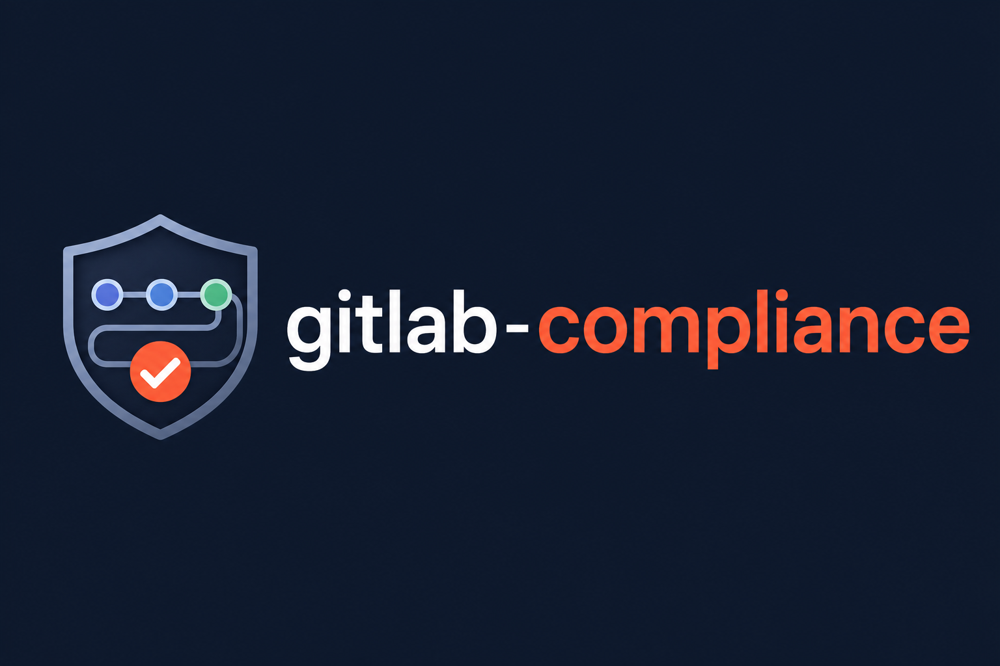
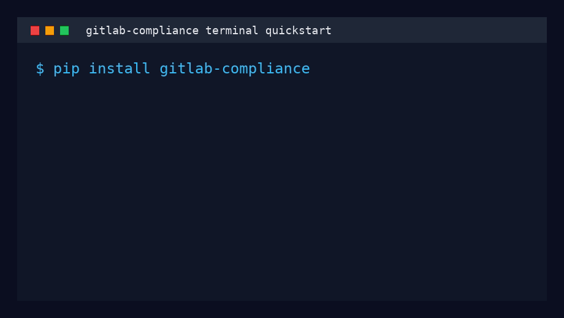

# GitLab Compliance home



This page mirrors the main [Overview](index.md) for readers who arrive at
`home.md` directly. `gitlab-compliance` is a BDD compliance testing and
documentation generation toolkit for GitLab CI/CD pipelines and project
settings.

[Get started](installation/index.md){ .md-button .md-button--primary }
[Usage reference](usage/index.md){ .md-button }
[BDD grammar](bdd-reference/index.md){ .md-button }

{ .mb-demo }

Source code:
[MaturityBuilder/gitlab-compliance](https://github.com/MaturityBuilder/gitlab-compliance).

## Get started

`gitlab-compliance` supports two core workflows from the same pipeline YAML:

| Workflow | Command | What it does |
| -------- | ------- | ------------ |
| **Compliance** | [`check`](usage/reference/check.md) | Run Gherkin policies against `.gitlab-ci.yml` (and optional GitLab API settings) |
| **Documentation** | [`generate`](usage/reference/generate.md) | Build Markdown, swagger-markdown, or HTML reference docs from `.gitlab-ci.yml` |

```bash
pip install gitlab-compliance

# Validate pipeline configuration against policies
gitlab-compliance check -f policies/security/ -p .gitlab-ci.yml

# Generate pipeline documentation (filter and group output as needed)
gitlab-compliance generate -i .gitlab-ci.yml --format swagger-markdown -o pipeline-reference.md
gitlab-compliance generate -i .gitlab-ci.yml --exclude variables,image --group-by stage
```

See [Usage](usage/index.md) for compliance options and [Generate pipeline documentation](usage/reference/generate.md) for output formats, `--exclude`, and `--group-by`.

| Capability | How it helps |
| ---------- | ------------ |
| Compliance as readable tests | Policies are Gherkin scenarios that developers and security teams can review together |
| Pre-merge feedback | Run checks before pipeline changes reach protected branches |
| Portable policy distribution | Store policy packs locally, in shared repos, or in OCI registries |
| Documentation from source | Generate references from real `.gitlab-ci.yml` content |

## Idea

`gitlab-compliance` focuses on [negative
testing](https://en.wikipedia.org/wiki/Negative_testing) — catching
misconfigurations and policy violations — rather than proving that a job runs
successfully end to end.

GitLab CI pipelines are defined in YAML that composes jobs, includes, variables,
and workflow rules. What was missing is a lightweight way to assert that this
configuration follows organizational standards before merge. GitLab offers
native compliance features in higher tiers; `gitlab-compliance` provides an
open, portable alternative inspired by
[terraform-compliance](https://terraform-compliance.com/) and
[Conftest](https://www.conftest.dev/).

For example, a policy might require that no job uses a floating `latest` image
tag:

```gherkin
if a job defines an image, it must not use the :latest tag
```

translates into:

```gherkin
Given I have any job defined
When it has image
Then its image must not match ":latest$"
```

The `image` value comes from your pipeline YAML:

```yaml
scan:
  image: python:3.12
build:
  image: docker:latest   # violates the policy above
```

In CI, this scenario runs against `.gitlab-ci.yml` (and resolved local includes)
so merge requests cannot introduce violations.

See [Examples](examples/index.md) for more sample use cases.

## Supporting / Requirements

- **Python:** 3.12 (see [Installing via pip](installation/pip.md))
- **Pipeline file:** `.gitlab-ci.yml` or another path passed with `-p`
- **API checks (optional):** GitLab token plus `--project` or `--group` for
  settings and CI variable policies

Full CLI options: [Usage](usage/index.md). Step grammar: [BDD
Reference](bdd-reference/index.md).

## How can you support the project?

Contributions are welcome — see [Contributing](contributing.md).
