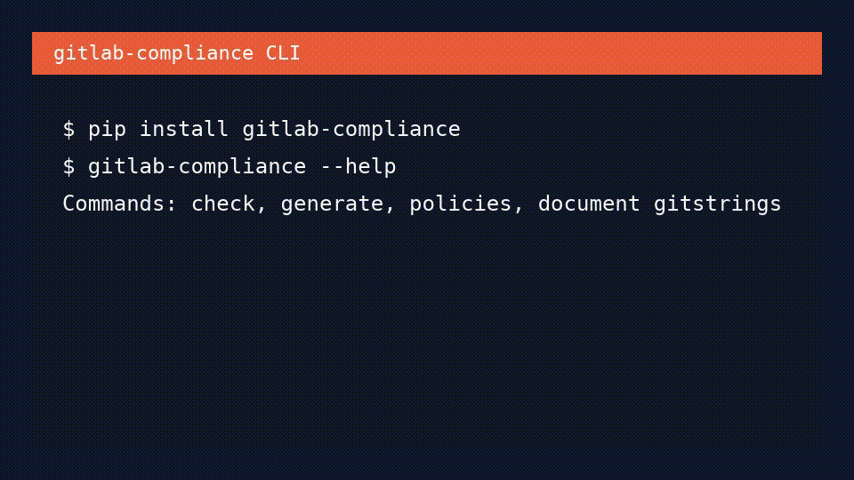

# gitlab-compliance

[](https://pypi.org/project/gitlab-compliance/)
[](https://hub.docker.com/r/maturitybuilder/gitlab-compliance/)
[](https://scorecard.dev/viewer/?uri=github.com/MaturityBuilder/gitlab-compliance)

**BDD compliance testing and pipeline documentation for GitLab CI/CD** — by
[MaturityBuilder](https://github.com/MaturityBuilder).

`gitlab-compliance` is a Python CLI that helps teams catch GitLab CI/CD
misconfigurations before merge. It runs readable Gherkin policies against
`.gitlab-ci.yml`, can optionally query the GitLab API for project or group
settings, and can generate Markdown or HTML reference documentation from the
same pipeline file.

Source code:
[MaturityBuilder/gitlab-compliance](https://github.com/MaturityBuilder/gitlab-compliance).

## Get started

[Get started](installation/index.md){ .md-button .md-button-primary }
[Usage reference](usage/index.md){ .md-button }
[BDD grammar](bdd-reference/index.md){ .md-button }

## What you can do

| Workflow | Command | Outcome |
| -------- | ------- | ------- |
| **Enforce compliance** | [`gitlab-compliance check`](usage/reference/check.md) | Fail builds when pipeline YAML or GitLab settings violate policy |
| **Document pipelines** | [`gitlab-compliance generate`](usage/reference/generate.md) | Create Markdown, swagger-style Markdown, or HTML documentation from `.gitlab-ci.yml` |
| **Share policy packs** | [`gitlab-compliance policies`](usage/reference/policies.md) | Document, push, and pull Gherkin policy bundles, including OCI registries |
| **Maintain template READMEs** | [`gitlab-compliance document gitstrings`](usage/gitstrings.md) | Render decorated YAML snippets into marker-delimited README tables |

## CLI in action



## Quick start

```bash
pip install gitlab-compliance

# Validate pipeline configuration against policies
gitlab-compliance check -f policies/ -p .gitlab-ci.yml

# Generate pipeline documentation
gitlab-compliance generate -i .gitlab-ci.yml --format swagger-markdown -o pipeline-reference.md
```

Use `--format markdown`, `--format html`, `--exclude`, and `--group-by` to
shape generated documentation for different audiences. See
[Usage](usage/index.md) for guided examples and
[Command Reference](usage/reference/command-reference.md) for every flag.

!!! tip "Run locally or in CI"

    The same commands work on a developer laptop, in GitLab CI/CD, in GitHub
    Actions, or through the published Docker image.

## Why this exists

`gitlab-compliance` focuses on [negative
testing](https://en.wikipedia.org/wiki/Negative_testing) — catching
misconfigurations and policy violations — rather than proving that a job runs
successfully end to end.

GitLab CI pipelines are defined in YAML that composes jobs, includes, variables,
and workflow rules. What was missing is a lightweight way to assert that this
configuration follows organizational standards before merge. GitLab offers
native compliance features in higher tiers; `gitlab-compliance` provides an
open, portable alternative inspired by
[terraform-compliance](https://terraform-compliance.com/) and
[Conftest](https://www.conftest.dev/).

For example, a policy might require that no job uses a floating `latest` image
tag:

```gherkin
No job may use a floating :latest container image tag
```

translates into:

```gherkin
Given I have any job defined
When it has image
Then its image must not match ":latest$"
```

The `image` value comes from your pipeline YAML:

```yaml
scan:
  image: python:3.12
build:
  image: docker:latest   # violates the policy above
```

In CI, this scenario runs against `.gitlab-ci.yml` (and resolved local includes)
so merge requests cannot introduce violations.

See [Examples](examples/index.md) for complete policy patterns.

## Requirements

- **Python:** 3.12 (see [Installing via pip](installation/pip.md))
- **Container runtime:** optional, for the published Docker image
- **Pipeline file:** `.gitlab-ci.yml` or another path passed with `-p`
- **API checks:** optional GitLab token plus `--project` or `--group` for
  settings, protected branches, and CI variable policies

Full CLI options: [Command Reference](usage/reference/command-reference.md).
Step grammar: [BDD Reference](bdd-reference/index.md).

## Contributing

Contributions are welcome — see [Contributing](contributing.md).
