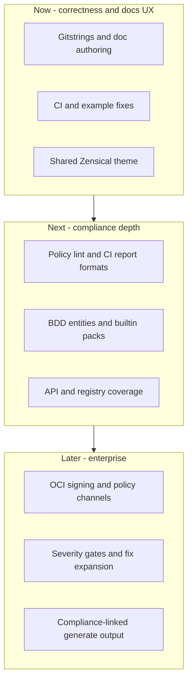

# Product roadmap

This roadmap organizes work to **improve and expand** [gitlab-compliance](index.md)
capabilities: BDD policy checks, GitLab API enrichment, OCI policy packs, and
pipeline documentation (`check`, `generate`, `document`, `policies`).

**GitHub project board:** [MaturityBuilder Project 3](https://github.com/orgs/MaturityBuilder/projects/3)

Use this page to align issues on that board with phases and dependencies. When
you add or reprioritize issues in the project, update the tables below (or link
issue numbers in the **Issue** column).

## Current capability baseline (v2.x)

| Area | Today |
| ---- | ----- |
| Compliance | Gherkin policies against `.gitlab-ci.yml` + optional GitLab API settings |
| Entities | Jobs, includes, variables, workflow rules, container images; limited API keys |
| Builtin pack | Four features under `--with-builtin` |
| Reports | Console, markdown, HTML, MR comment, GitLab Code Quality |
| Policies | Local dirs + OCI push/pull (`oras`) |
| Docs | `generate` (markdown / swagger-markdown / HTML), `get-attributes`, `release-notes` |
| CI | GitLab CI, GitHub Actions, Pipeline Execution Policy examples |

## How to use this with Project 3

Suggested board columns:

| Column | Purpose |
| ------ | ------- |
| **Now** | In progress; blockers for adoption |
| **Next** | Ready when **Now** clears |
| **Later** | Strategic expansion |
| **Done** | Shipped; keep for release notes |

Label suggestions: `enhancement`, `bug`, `documentation`, `security`, `breaking-change`, `good first issue`.

---

## Phase 0 — Done (reference)

Work already merged or released; keep on the board only for traceability.

| Issue | Title | Outcome |
| ----- | ----- | ------- |
| [#11](https://github.com/MaturityBuilder/gitlab-compliance/issues/11) | Dual CLI (`gitlab-compliance` + deprecated `gitlab-docs`) | Single Click group, two entry points |
| [#20](https://github.com/MaturityBuilder/gitlab-compliance/issues/20) | MkDocs build and publish | Docs CI on GitLab Pages and GitHub Pages |
| [#21](https://github.com/MaturityBuilder/gitlab-compliance/issues/21) | MkDocs Material site and review builds | MR review artifacts |
| [#22](https://github.com/MaturityBuilder/gitlab-compliance/issues/22) | GitHub Pages, Docker, docs polish | Container image and site hosting |
| [#27](https://github.com/MaturityBuilder/gitlab-compliance/issues/27) | Disable container scanning SARIF upload | CI security tab noise reduced |
| [#29](https://github.com/MaturityBuilder/gitlab-compliance/issues/29) | BDD outlines, builtin policies, test coverage | v2.1.0 feature bundle |

---

## Phase 1 — Now (in flight)

Active or open PRs; prioritize finishing before new surface area.

| Issue / PR | Title | Why it matters | Acceptance hints |
| ---------- | ----- | -------------- | ---------------- |
| [#28](https://github.com/MaturityBuilder/gitlab-compliance/pull/28) | Reusable MaturityBuilder Zensical theme | Consistent docs across MaturityBuilder repos | Theme installable from `theme/maturitybuilder-zensical/`; CI builds with `zensical build --strict` |
| [#31](https://github.com/MaturityBuilder/gitlab-compliance/pull/31) | `document gitstrings` command | Inline YAML→table docs in READMEs without overwriting prose | Marker blocks; `@title` / `@render` / `@description` |
| [#32](https://github.com/MaturityBuilder/gitlab-compliance/pull/32) | Gitstrings `@render` paths and `@sensitive` | Pinpoint subtrees; mask secrets in tables | Dot paths; `****` for sensitive leaves |
| [#35](https://github.com/MaturityBuilder/gitlab-compliance/pull/35) | Fix `get-attributes` list formatting | Docs tables match `generate` formatting | No raw Python literals in cells |
| [#33](https://github.com/MaturityBuilder/gitlab-compliance/pull/33)–[#37](https://github.com/MaturityBuilder/gitlab-compliance/pull/37) | Docs refresh and agent dev notes | Onboarding and copy-paste-safe examples | Strict link check; updated CI examples |

**New issue (recommended):** Fix GitHub Actions Docker examples that invoke `compliance` instead of `check` (`docs/ci-cd/github-actions.md`, `examples/example-github-actions/compliance-container.yml`). **Labels:** `bug`, `documentation`.

---

## Phase 2 — Next (core compliance expansion)

Deepen the policy engine and adoption path; depends on Phase 1 example accuracy.

| Suggested issue title | Capability | Key areas |
| --------------------- | ---------- | --------- |
| Add `policies validate` (policy pack lint) | Catch unknown steps and bad metadata before CI | `runner.py`, `metadata.py`, CLI |
| Add JUnit and SARIF report formats | Universal CI and security tab integration | `render.py`, `constants.py`, behave features |
| Ship security example pack as optional `--with-builtin` tiers | Close gap between 4 builtins and `examples/example-policies/security/` | `builtin_policies/`, docs |
| BDD: `spec.inputs` and filterable `rules` entities | Policies for pipeline inputs and rule blocks | `model.py`, `given_steps.py`, BDD reference |
| Policy severity and subset filters (`--severity`, `--policy-id`) | Gate merges on critical-only failures | `runner.py`, `console.py` |
| Harden OCI `--update` cache behavior | Predictable “always latest” pulls in CI | `gitlab_compliance.py`, `oci_registry.py` |
| CI: regenerate command reference on CLI change | `dumps` output stays in sync | `.github/workflows/`, `command_reference.py` |

**Dependencies:** Report formats before SARIF upload is re-enabled in `.github/workflows/docker.yml`.

---

## Phase 3 — Next (GitLab API and supply chain)

Expand what policies can assert beyond static YAML.

| Suggested issue title | Capability | Key areas |
| --------------------- | ---------- | --------- |
| Broaden project/group API settings catalog | Protected branches, MR approvals, more project keys | `gitlab_api.py`, example policies |
| Stricter API auth failures (`--strict` default in CI templates) | No silent skip when token is wrong | `model.py`, `api_config.py` |
| Registry matrix: GHCR, ECR, generic OCI for image enrichment | Image pinning policies with metadata | `image_versions.py` |
| Fix API enrichment marker heuristics | Image-only policies still trigger registry lookups when intended | `api_enrichment.py` |
| Extend `--fix` (dry-run, branch refs, `latest` tags) | Safer auto-remediation | `supply_chain_fix.py`, docs |

---

## Phase 4 — Later (enterprise and ecosystem)

| Suggested issue title | Capability | Key areas |
| --------------------- | ---------- | --------- |
| OCI policy bundle signing (cosign) and version channels | Trusted policy distribution | `oci_registry.py`, OCI examples |
| `policies diff` / `policies sync` (local vs registry) | Review before `--update` in pipelines | CLI, `oci_registry.py` |
| Compliance annotations in `generate` HTML output | Docs highlight failing jobs from last `check` | `pipeline_data.py`, `render.py` |
| Remove `gitlab-docs` entry point (major release) | Complete rebrand | `pyproject.toml`, examples, breaking-change note |
| Remove unused `typer` dependency | Smaller install footprint | `pyproject.toml` |
| Behave e2e for OCI push/pull and `--with-builtin` | Regression safety for distribution path | `features/` |

---

## Cross-cutting quality

| Suggested issue title | Notes |
| --------------------- | ----- |
| Behave scenarios for multi-`When` / `And` edge cases | Align with `bdd-reference/using-and.md` |
| Fix doc path drift (`example-ci` vs `examples/example-ci`) | Reduces contributor confusion |
| Live OCI registry smoke test (optional nightly) | Complements mocked `test_oci_registry.py` |

---

## Mapping issues into Project 3

1. Open [Project 3](https://github.com/orgs/MaturityBuilder/projects/3).
2. For each row above, create or link a GitHub issue in `MaturityBuilder/gitlab-compliance`.
3. Set the project **Status** field to Now / Next / Later / Done.
4. Add **dependencies** using “blocked by” links (e.g. SARIF upload blocked by SARIF report format).

If you export the project as CSV or grant the automation account **Issues: Read** and **Projects: Read** on the org, this document can be updated to mirror issue numbers and statuses automatically.

## Related links

- [Contributing](contributing.md)
- [Examples](examples/index.md)
- [BDD reference](bdd-reference/index.md)
- [OCI policy packs](examples/oci-policy-packs.md)
