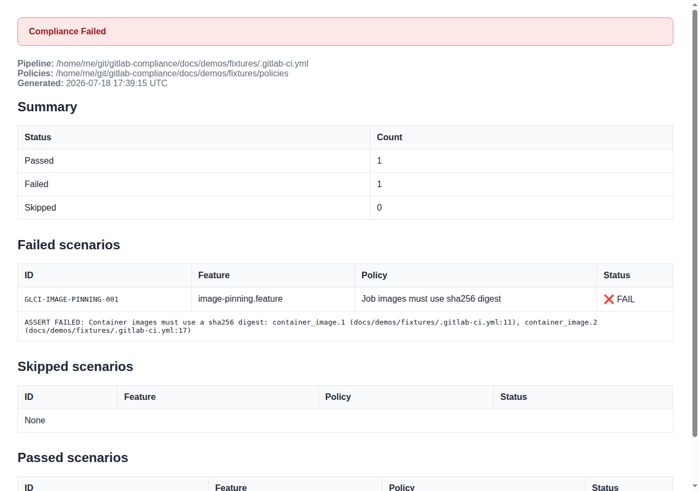
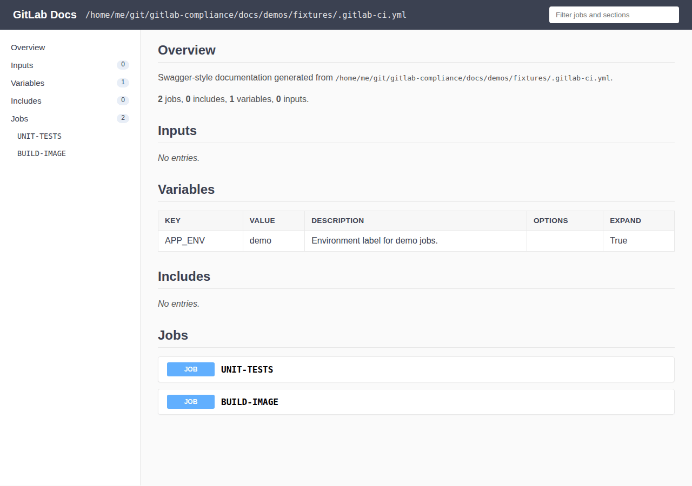

# Usage

CLI getting started, common flags, demos, and links into each command page.

Regardless of how you [install](../installation/index.md) `gitlab-compliance`,
the tool supports two primary workflows:


### Compliance (`check`)

1. Author Gherkin policies (`.feature` files) in a directory or OCI registry
2. Point the CLI at your pipeline YAML
3. Optionally enable GitLab API checks with a token and project path
4. Fail the job on violations (default exit code `1`)

```bash
gitlab-compliance check -h
```

### Documentation (`generate`)

1. Point the CLI at your pipeline YAML
2. Choose an output format (`markdown`, `swagger-markdown`, or `html`)
3. Optionally exclude sections or job attributes, or group jobs by attribute

```bash
gitlab-compliance generate -h
gitlab-compliance generate -i .gitlab-ci.yml --format swagger-markdown -o pipeline-reference.md
gitlab-compliance generate -i .gitlab-ci.yml --exclude variables,workflow --group-by stage
```

See [Generate pipeline documentation](reference/generate.md) and
[Check](reference/check.md) for full option details.

## CLI reference

### `-f` / `--features`

**Required** for `check`, `policies doc`, and `policies push`.

Directory of `.feature` policy files, or an OCI reference:

```bash
gitlab-compliance check -f policies/ -p .gitlab-ci.yml
gitlab-compliance check -f oci://registry.example.com/org/policies:1.0.0 -p
.gitlab-ci.yml
```

Use `--update` with OCI references to pull the latest bundle before running.

### `--with-builtin` {#with-builtin}

Also run bundled baseline policies shipped inside the `gitlab-compliance`
package. Your `-f` directory is **optional** when this flag is set; omit `-f`
to run only the bundled pack, or pass `-f` to merge your policies alongside it.

```bash
gitlab-compliance check -p .gitlab-ci.yml --with-builtin
```

Bundled policies include plain scenarios (job images, include pinning) and
**advanced Scenario Outline** matrices (variable allowlists, component input
constraints). See [Advanced scenarios](../bdd-reference/advanced-scenarios.md).

### `--with-shell-check` {#with-shell-check}

Also run packaged **shell script standards** (`GLCI-SHELL-*`) for
`before_script`, `script`, and `after_script`. Your `-f` directory is
**optional** when this flag is set; omit `-f` to run only the packaged shell
policies.

```bash
gitlab-compliance check -p .gitlab-ci.yml --with-shell-check
```

Equivalent to running `shell-check` in the same invocation. See
[`shell-check`](reference/shell-check.md).

### `--with-supply-chain` {#with-supply-chain}

Also run packaged supply-chain pinning policies for includes, components,
container images, and services. Your `-f` directory is **optional** when this
flag is set.

```bash
gitlab-compliance check -p .gitlab-ci.yml --with-supply-chain
```

Equivalent to `supply-chain` in the same invocation. See
[`supply-chain`](reference/supply-chain.md).

`--with-builtin` still includes shell policies because they live under
`builtin_policies/shell/`; use `--with-shell-check` when you only want script
checks added to your own policy set.

### `-p` / `--pipeline`

Path to the GitLab CI pipeline YAML (default: `.gitlab-ci.yml`).

```bash
gitlab-compliance check -f policies/ -p .gitlab-ci.yml
```

### `--project` / `--group`

Enable API-backed scenarios against project or group settings. Requires a GitLab
token — see [Environment Variables](environment-variables.md).

```bash
export GITLAB_TOKEN="<token>"
gitlab-compliance check -f policies/ -p .gitlab-ci.yml --project
my-group/my-project
```

API scenarios are **skipped** when connection info is missing unless you pass
`--strict`.

### `--format` / `-o`

Report format and output file:

| Format        | Purpose                                                  |
| ------------- | -------------------------------------------------------- |
| `console`     | Rich tables in the terminal (default)                    |
| `markdown`    | Human-readable report file                               |
| `html`        | HTML report                                              |
| `mr-comment`  | GitLab merge request comment body                        |
| `codequality` | GitLab Code Quality JSON (`gl-code-quality-report.json`) |

```bash
gitlab-compliance check -f policies/ -p .gitlab-ci.yml --format markdown -o
COMPLIANCE-REPORT.md
```

### Other commands

| Command               | Description                                                       |
| --------------------- | ----------------------------------------------------------------- |
| `check`               | Run Gherkin compliance policies against pipeline YAML             |
| `shell-check`         | Run packaged Gherkin shell standards for CI scripts (not ShellCheck) |
| `generate`            | Build Markdown or HTML documentation from pipeline YAML           |
| `get-attributes`      | Export selected job attributes as a table                         |
| `policies doc`        | Generate a policy catalog from `# METADATA` annotations         |
| `policies push`       | Publish a policy bundle to an OCI registry                        |
| `policies pull`       | Pull a policy bundle from an OCI registry                         |
| `release-notes`       | Generate release notes from GitLab commits                        |
| `document gitstrings` | Render inline `yaml gitstrings` fences into README marker blocks  |

### Template documentation

For ci-template READMEs, use [`document gitstrings`](gitstrings.md) to turn decorated YAML snippets into tables inside gitstrings markers (alongside [`generate`](reference/generate.md) for full pipeline YAML).

## Quick start

**Compliance**

```bash
pip install gitlab-compliance
cp -r examples/example-policies/security/ policies/
gitlab-compliance check -f policies/ -p .gitlab-ci.yml
```

**Documentation**

```bash
pip install gitlab-compliance
gitlab-compliance generate -i .gitlab-ci.yml --format swagger-markdown -o pipeline-reference.md
```

Sample generated output: [GitLab Docs output example](../examples/gitlab-docs-output-example.md).

See also [Check](reference/check.md) and
[Environment Variables](environment-variables.md).

## Demos

All generated offline demos. Details and option-level embeds live on each
command page below. Recording: [demos README](../demos/README.md).

### [`check`](reference/check.md)





### [`generate`](reference/generate.md)




### [`get-attributes`](reference/get-attributes.md)


### [`policies doc`](reference/policies-doc.md)


### [`document gitstrings`](gitstrings.md)


