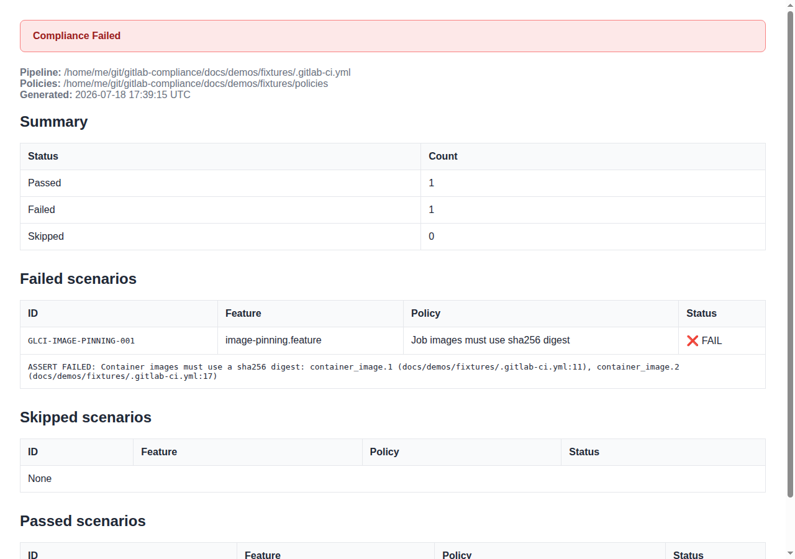
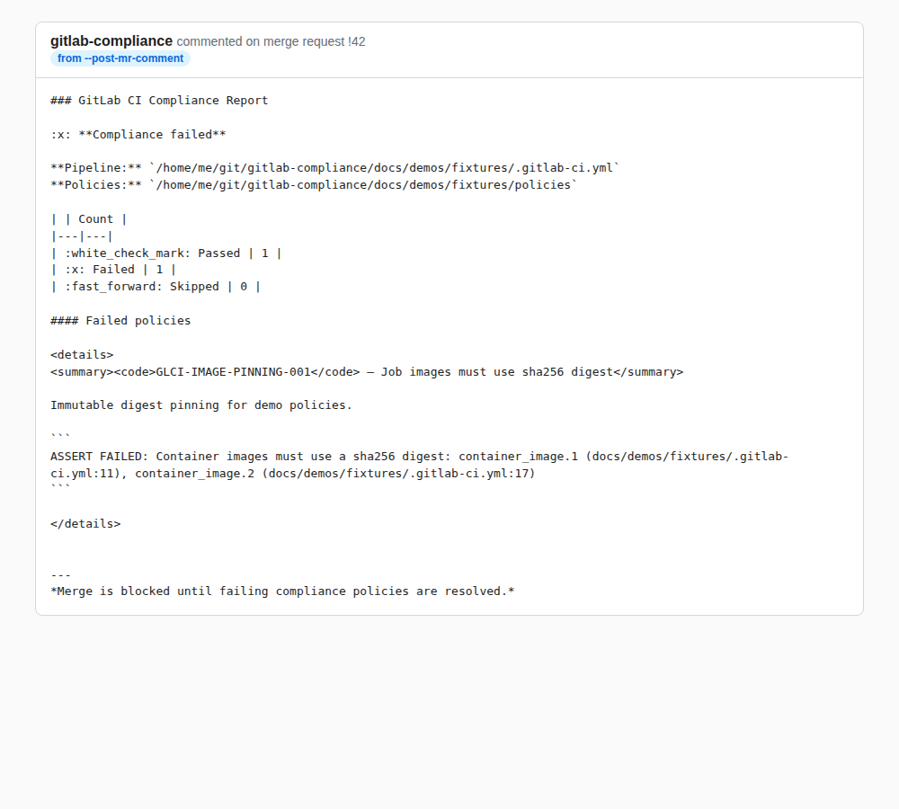
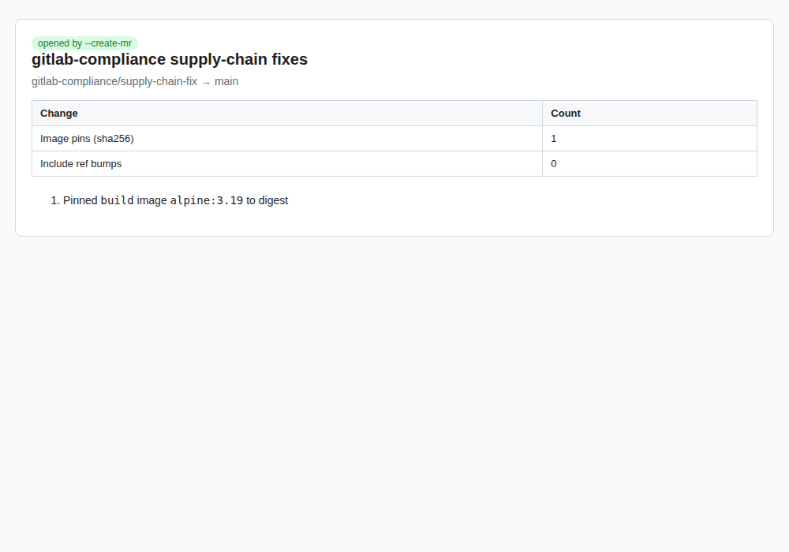

# check

Run Gherkin compliance policies against GitLab CI YAML and optional API settings.

<!-- MANUAL DOCS:START -->

## See it in action

Offline demos use the fixtures under `docs/demos/fixtures/`. Regenerate with
`bash scripts/record-demos.sh offline` (see [demos README](../../demos/README.md)).

### Console report


### Markdown report


### HTML report

CLI writes the HTML file, then the rendered report:




### Merge request comment body

`--format mr-comment` writes a comment-ready body. Post it with
`--post-mr-comment` (live tape: `bash scripts/record-demos.sh live`).




### Supply-chain fix merge request

`--fix-supply-chain --create-mr` opens or updates an MR. Offline GIF shows the
dry-run prelude;




## Option details

Narrative notes for options that need more than the CLI help text. Defaults and
types remain in **Options** / **CLI Help** above.

### Pipeline resolution

#### `--include-nested` / `--no-include-nested` {#include-nested}

**Default:** nested local includes are resolved.

When enabled, `include:` entries that reference local project files are merged
into the compliance entity stash so policies can see jobs and variables from
included fragments.

```bash
gitlab-compliance check -f policies/ -p .gitlab-ci.yml --no-include-nested
```

#### `--max-include-depth` {#max-include-depth}

**Default:** unlimited (omit the flag).

Limits how many local-include hops are followed from the root pipeline file when
nesting is enabled. Depth `0` is the root file; depth `1` is files included
directly by the root.

```bash
gitlab-compliance check -f policies/ -p .gitlab-ci.yml --max-include-depth 2
```

Also available on `generate` and `document gitstrings`.

### API checks

#### `--strict` {#strict}

**Default:** off (API scenarios skip when token or project/group is missing).

When enabled, API-backed `Given` steps fail instead of skipping if
`GITLAB_TOKEN` / `CI_JOB_TOKEN` and `--project` or `--group` are not available.

```bash
gitlab-compliance check -f policies/ -p .gitlab-ci.yml --strict
```

Use `--strict` in CI jobs that must enforce API checks.

#### `--gitlab-url` {#gitlab-url}

GitLab instance URL for API checks. Defaults to `CI_SERVER_URL` or
`https://gitlab.com`.

```bash
gitlab-compliance check -f policies/ -p .gitlab-ci.yml \
  --gitlab-url https://gitlab.example.com --project my-group/my-project
```

### Dry run

#### `--dry-run` {#dry-run}

Parse scenarios and list them without running assertions.

```bash
gitlab-compliance check -f policies/ -p .gitlab-ci.yml --dry-run
```

### Supply-chain and policy remediations

#### `--fix-supply-chain` {#fix-supply-chain}

Auto-remediate supply-chain issues before running policies:

- **Project/component includes** — bump `ref:` or `@version` to the latest
  semver tag from GitLab
- **Container images** — rewrite `image:` / `services:` to `@sha256:<digest>`
  for the resolved tag

**Trust model:** remediations trust GitLab release/tag metadata and registry
digest resolution for “latest”. Compromised upstream tags or registries can
cause the tool to pin or bump to attacker-controlled versions. Review every
`--create-mr` diff before merge.

Requires a GitLab token (`--token`, `GITLAB_TOKEN`, or `CI_JOB_TOKEN`). Cannot
be combined with `--dry-run`.

```bash
gitlab-compliance check -f policies/security/ -p .gitlab-ci.yml \
  --fix-supply-chain
```

#### `--fix-policies` {#fix-policies}

After an initial policy run, apply **allowlisted** BDD remediations (YAML only),
then re-check. Only entities that fail the matching policy predicates are
rewritten (not every include/image in the pipeline). See
[Auto-fix policies](../fix-policies.md) for the supported policy IDs.

Requires a GitLab token. Cannot be combined with `--dry-run`.

```bash
gitlab-compliance check -f policies/security/ -p .gitlab-ci.yml --fix-policies
```

#### `--create-mr` {#create-mr}

After `--fix-supply-chain` and/or `--fix-policies` rewrites local YAML, commit
the changed files and open a GitLab merge request. Requires at least one fix
mode, `--project` (or `CI_PROJECT_PATH`), and a token that can create branches,
commits, and merge requests.

Use a **project access token** or **personal access token** (`--token` /
`GITLAB_TOKEN`) with `api` (and write) scope. `CI_JOB_TOKEN` is **rejected** for
`--create-mr` (it usually cannot create branches or merge requests). If MR
creation fails for other reasons, the compliance report is still printed and the
process exits `2` when policies otherwise passed.

Fix messages and MR comment bodies are scrubbed for known token patterns and
values from common secret environment variables before they are logged or posted
to GitLab.

If an open merge request already exists for the source branch, the run pushes a
new commit and updates that MR. If the branch still exists but the MR was
**closed** (not merged), the run reopens the most recently updated closed MR for
that branch. The default source branch is
`gitlab-compliance/supply-chain-fix` so re-runs reuse the same MR.

New or missing files on the branch are committed with `create`; existing paths
use `update`. If branch creation succeeds but the first commit fails, the error
names the branch so you can delete or repair it.

The MR description includes a short summary table and a numbered list of applied
changes.

Optional: `--mr-branch`, `--mr-target-branch`.

```bash
gitlab-compliance check -f policies/security/ -p .gitlab-ci.yml \
  --fix-supply-chain --create-mr --project "$CI_PROJECT_PATH" \
  --token "$GITLAB_TOKEN"
```


#### `--post-mr-comment` {#post-mr-comment}

Post the compliance report as a note on an existing merge request. Uses
`--mr-iid` or `CI_MERGE_REQUEST_IID`. Optional `--mr-comment-file` posts a
pre-rendered body instead of regenerating from the run. Comment content
(including file bodies) is secret-redacted before posting.

Failures print an error (and log it) after the compliance report; when policies
passed, the process exits `2`.

```bash
gitlab-compliance check -f policies/security/ -p .gitlab-ci.yml \
  --post-mr-comment --project "$CI_PROJECT_PATH"
```


### Bundled policies

#### `--with-builtin` {#with-builtin}

Also run baseline policies shipped inside the package (job images, include
pinning, variable allowlists, component input outlines). Your `-f` directory is
optional when this flag is set; omit `-f` to run only the bundled baseline pack.

```bash
gitlab-compliance check -p .gitlab-ci.yml --with-builtin
```

#### `--with-shell-check` {#with-shell-check}

Also run packaged `GLCI-SHELL-*` script standards for `before_script`,
`script`, and `after_script`. Use this when you want shell checks without
enabling the other bundled YAML baseline rules. Omit `-f` to run only the
packaged shell policies.

```bash
gitlab-compliance check -p .gitlab-ci.yml --with-shell-check
```

Equivalent to combining your policy directory with `shell-check` in one run.
See [`shell-check`](shell-check.md).

#### `--with-supply-chain` {#with-supply-chain}

Also run packaged supply-chain pinning policies for includes, images, and
services. Read-only checks; use `--fix-supply-chain` to auto-remediate YAML.
Omit `-f` to run only the bundled supply-chain pack.

```bash
gitlab-compliance check -p .gitlab-ci.yml --with-supply-chain
```

Equivalent to `supply-chain` in the same invocation. See
[`supply-chain`](supply-chain.md).

`--with-builtin` uses only top-level bundled policies (not `shell/` or
`supply-chain/`). Combine flags to merge multiple bundled packs without
duplicating scenarios.

### OCI policy bundles

#### `--update` {#update}

With an OCI `-f` reference, pull the latest policy bundle before executing
checks.

```bash
gitlab-compliance check -f oci://registry.example.com/org/policies:1.0.0 \
  -p .gitlab-ci.yml --update
```

#### `--policy-cache-dir` {#policy-cache-dir}

Directory used when extracting OCI policy bundles (default: system temp
directory).

```bash
gitlab-compliance check -f oci://registry.example.com/org/policies:1.0.0 \
  -p .gitlab-ci.yml --policy-cache-dir /tmp/policy-cache
```

<!-- MANUAL DOCS:END -->


## Usage

```
Usage: gitlab-compliance check [OPTIONS]
```

## Options
* `features_dir`:
  * Type: STRING
  * Default: `none`
  * Usage: `--features
-f`

  Directory containing compliance policy .feature files or an OCI reference (oci://registry.example.com/policies:1.0.0). Optional when --with-builtin, --with-shell-check, and/or --with-supply-chain is set.

* `pipeline_file`:
  * Type: STRING
  * Default: `.gitlab-ci.yml`
  * Usage: `--pipeline
-p`

  Path to the GitLab CI pipeline YAML file.

* `output_format`:
  * Type: Choice(['console', 'markdown', 'html', 'mr-comment', 'codequality'])
  * Default: `console`
  * Usage: `--format`

  Output format for the compliance report.

* `output_file`:
  * Type: STRING
  * Default: `none`
  * Usage: `--output-file
-o`

  Write rendered report to this file (markdown, html, mr-comment).

* `include_nested`:
  * Type: BOOL
  * Default: `true`
  * Usage: `--include-nested`

  Resolve nested local include files into the compliance stash.

* `max_include_depth`:
  * Type: INT
  * Default: `none`
  * Usage: `--max-include-depth`

  Max local include nesting depth from the root file (omit for unlimited).

* `gitlab_url`:
  * Type: STRING
  * Default: `none`
  * Usage: `--gitlab-url`

  GitLab instance URL (default: CI_SERVER_URL or https://gitlab.com).

* `token`:
  * Type: STRING
  * Default: `none`
  * Usage: `--token`

  GitLab API token (default: GITLAB_TOKEN or CI_JOB_TOKEN).

* `project`:
  * Type: STRING
  * Default: `none`
  * Usage: `--project`

  GitLab project path or ID for API-backed policy checks.

* `group`:
  * Type: STRING
  * Default: `none`
  * Usage: `--group`

  GitLab group path or ID for API-backed policy checks.

* `strict`:
  * Type: BOOL
  * Default: `false`
  * Usage: `--strict`

  Fail API-backed scenarios when connection info is missing (default: skip).

* `update`:
  * Type: BOOL
  * Default: `false`
  * Usage: `--update`

  Pull the latest policies from an OCI registry before running checks.

* `policy_cache_dir`:
  * Type: STRING
  * Default: `none`
  * Usage: `--policy-cache-dir`

  Directory used when pulling OCI policy bundles (default: system temp).

* `dry_run`:
  * Type: BOOL
  * Default: `false`
  * Usage: `--dry-run`

  Parse and list scenarios without asserting.

* `fix_supply_chain`:
  * Type: BOOL
  * Default: `false`
  * Usage: `--fix-supply-chain`

  Auto-fix outdated include refs and pin container images to sha256 digests (mutates YAML; not the same as --with-supply-chain policy checks).

* `fix_policies`:
  * Type: BOOL
  * Default: `false`
  * Usage: `--fix-policies`

  After an initial policy run, apply allowlisted BDD remediations (see docs/usage/fix-policies.md), then re-check.

* `create_mr`:
  * Type: BOOL
  * Default: `false`
  * Usage: `--create-mr`

  After --fix-supply-chain and/or --fix-policies, commit changed files and open a GitLab merge request (requires --token/GITLAB_TOKEN PAT; CI_JOB_TOKEN is rejected; failures exit 2 after the report).

* `post_mr_comment`:
  * Type: BOOL
  * Default: `false`
  * Usage: `--post-mr-comment`

  Post the compliance mr-comment body to a GitLab merge request.

* `mr_iid`:
  * Type: INT
  * Default: `none`
  * Usage: `--mr-iid`

  Merge request IID for --post-mr-comment (default: CI_MERGE_REQUEST_IID).

* `mr_branch`:
  * Type: STRING
  * Default: `none`
  * Usage: `--mr-branch`

  Source branch for --create-mr (default: gitlab-compliance/supply-chain-fix). Reuses an open MR for this branch, or reopens a closed one.

* `mr_target_branch`:
  * Type: STRING
  * Default: `none`
  * Usage: `--mr-target-branch`

  Target branch for --create-mr (default: project default branch).

* `mr_comment_file`:
  * Type: STRING
  * Default: `none`
  * Usage: `--mr-comment-file`

  Optional pre-rendered markdown file to post with --post-mr-comment.

* `with_builtin`:
  * Type: BOOL
  * Default: `false`
  * Usage: `--with-builtin`

  Also run bundled baseline policies shipped with gitlab-compliance.

* `with_shell_check`:
  * Type: BOOL
  * Default: `false`
  * Usage: `--with-shell-check`

  Also run packaged GLCI-SHELL script standards for before_script, script, and after_script.

* `with_supply_chain`:
  * Type: BOOL
  * Default: `false`
  * Usage: `--with-supply-chain`

  Also run packaged supply-chain pinning policies (include, image, and service pinning). Read-only checks; use --fix-supply-chain to auto-remediate YAML.

* `help`:
  * Type: BOOL
  * Default: `false`
  * Usage: `--help`

  Show this message and exit.


## CLI Help

```
Usage: gitlab-compliance check [OPTIONS]

  Run Gherkin compliance policies against GitLab CI YAML and optional API
  settings.

Options:
  -f, --features TEXT             Directory containing compliance policy
                                  .feature files or an OCI reference
                                  (oci://registry.example.com/policies:1.0.0).
                                  Optional when --with-builtin, --with-shell-
                                  check, and/or --with-supply-chain is set.
  -p, --pipeline TEXT             Path to the GitLab CI pipeline YAML file.
  --format [console|markdown|html|mr-comment|codequality]
                                  Output format for the compliance report.
  -o, --output-file TEXT          Write rendered report to this file
                                  (markdown, html, mr-comment).
  --include-nested / --no-include-nested
                                  Resolve nested local include files into the
                                  compliance stash.
  --max-include-depth INTEGER     Max local include nesting depth from the
                                  root file (omit for unlimited).
  --gitlab-url TEXT               GitLab instance URL (default: CI_SERVER_URL
                                  or https://gitlab.com).
  --token TEXT                    GitLab API token (default: GITLAB_TOKEN or
                                  CI_JOB_TOKEN).
  --project TEXT                  GitLab project path or ID for API-backed
                                  policy checks.
  --group TEXT                    GitLab group path or ID for API-backed
                                  policy checks.
  --strict                        Fail API-backed scenarios when connection
                                  info is missing (default: skip).
  --update                        Pull the latest policies from an OCI
                                  registry before running checks.
  --policy-cache-dir TEXT         Directory used when pulling OCI policy
                                  bundles (default: system temp).
  --dry-run                       Parse and list scenarios without asserting.
  --fix-supply-chain              Auto-fix outdated include refs and pin
                                  container images to sha256 digests (mutates
                                  YAML; not the same as --with-supply-chain
                                  policy checks).
  --fix-policies                  After an initial policy run, apply
                                  allowlisted BDD remediations (see
                                  docs/usage/fix-policies.md), then re-check.
  --create-mr                     After --fix-supply-chain and/or --fix-
                                  policies, commit changed files and open a
                                  GitLab merge request (requires
                                  --token/GITLAB_TOKEN PAT; CI_JOB_TOKEN is
                                  rejected; failures exit 2 after the report).
  --post-mr-comment               Post the compliance mr-comment body to a
                                  GitLab merge request.
  --mr-iid INTEGER                Merge request IID for --post-mr-comment
                                  (default: CI_MERGE_REQUEST_IID).
  --mr-branch TEXT                Source branch for --create-mr (default:
                                  gitlab-compliance/supply-chain-fix). Reuses
                                  an open MR for this branch, or reopens a
                                  closed one.
  --mr-target-branch TEXT         Target branch for --create-mr (default:
                                  project default branch).
  --mr-comment-file TEXT          Optional pre-rendered markdown file to post
                                  with --post-mr-comment.
  --with-builtin                  Also run bundled baseline policies shipped
                                  with gitlab-compliance.
  --with-shell-check              Also run packaged GLCI-SHELL script
                                  standards for before_script, script, and
                                  after_script.
  --with-supply-chain             Also run packaged supply-chain pinning
                                  policies (include, image, and service
                                  pinning). Read-only checks; use --fix-
                                  supply-chain to auto-remediate YAML.
  --help                          Show this message and exit.
```
