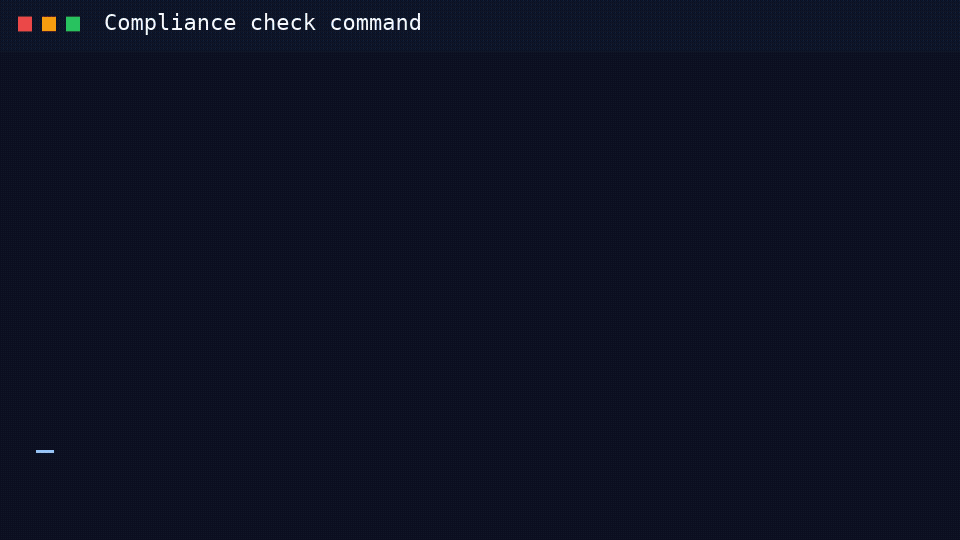

# check

Run Gherkin compliance policies against GitLab CI YAML and optional API settings.

## Animated demo



## Usage

```text
Usage: gitlab-compliance check [OPTIONS]
```

## Options

| Parameter | Required | Type | Default | Usage | Description |
| --------- | -------- | ---- | ------- | ----- | ----------- |
| `features_dir` | Yes | `text` | `None` | `--features, -f` | Directory containing compliance policy `.feature` files or an OCI reference (`oci://registry.example.com/policies:1.0.0`). |
| `pipeline_file` | No | `text` | `.gitlab-ci.yml` | `--pipeline, -p` | Path to the GitLab CI pipeline YAML file. |
| `output_format` | No | `choice: console, markdown, html, mr-comment, codequality` | `console` | `--format` | Output format for the compliance report. |
| `output_file` | No | `text` | `None` | `--output-file, -o` | Write rendered report to this file (`markdown`, `html`, `mr-comment`). |
| `include_nested` | No | `boolean` | `True` | `--include-nested, --no-include-nested` | Resolve nested local include files into the compliance stash. |
| `gitlab_url` | No | `text` | `None` | `--gitlab-url` | GitLab instance URL. Defaults to `CI_SERVER_URL` or `https://gitlab.com`. |
| `token` | No | `text` | `None` | `--token` | GitLab API token. Defaults to `GITLAB_TOKEN` or `CI_JOB_TOKEN`. |
| `project` | No | `text` | `None` | `--project` | GitLab project path or ID for API-backed policy checks. |
| `group` | No | `text` | `None` | `--group` | GitLab group path or ID for API-backed policy checks. |
| `strict` | No | `boolean` | `False` | `--strict` | Fail API-backed scenarios when connection info is missing. |
| `update` | No | `boolean` | `False` | `--update` | Pull the latest policies from an OCI registry before running checks. |
| `policy_cache_dir` | No | `text` | `None` | `--policy-cache-dir` | Directory used when pulling OCI policy bundles. Defaults to system temp. |
| `dry_run` | No | `boolean` | `False` | `--dry-run` | Parse and list scenarios without asserting. |
| `fix` | No | `boolean` | `False` | `--fix` | Auto-fix outdated include refs and pin container images to sha256 digests. |
| `with_builtin` | No | `boolean` | `False` | `--with-builtin` | Also run bundled baseline policies shipped with `gitlab-compliance`. |
| `help` | No | `boolean` | `False` | `--help` | Show this message and exit. |

## CLI Help

```text
Usage: gitlab-compliance check [OPTIONS]

  Run Gherkin compliance policies against GitLab CI YAML and optional API
  settings.

Options:
  -f, --features TEXT             Directory containing compliance policy
                                  .feature files or an OCI reference
                                  (oci://registry.example.com/policies:1.0.0).
                                  [required]
  -p, --pipeline TEXT             Path to the GitLab CI pipeline YAML file.
  --format [console|markdown|html|mr-comment|codequality]
                                  Output format for the compliance report.
  -o, --output-file TEXT          Write rendered report to this file
                                  (markdown, html, mr-comment).
  --include-nested / --no-include-nested
                                  Resolve nested local include files into the
                                  compliance stash.
  --gitlab-url TEXT               GitLab instance URL (default: CI_SERVER_URL
                                  or https://gitlab.com).
  --token TEXT                    GitLab API token (default: GITLAB_TOKEN or
                                  CI_JOB_TOKEN).
  --project TEXT                  GitLab project path or ID for API-backed
                                  policy checks.
  --group TEXT                    GitLab group path or ID for API-backed
                                  policy checks.
  --strict                        Fail API-backed scenarios when connection
                                  info is missing (default: skip).
  --update                        Pull the latest policies from an OCI
                                  registry before running checks.
  --policy-cache-dir TEXT         Directory used when pulling OCI policy
                                  bundles (default: system temp).
  --dry-run                       Parse and list scenarios without asserting.
  --fix                           Auto-fix outdated include refs and pin
                                  container images to sha256 digests.
  --with-builtin                  Also run bundled baseline policies shipped
                                  with gitlab-compliance.
  --help                          Show this message and exit.
```
