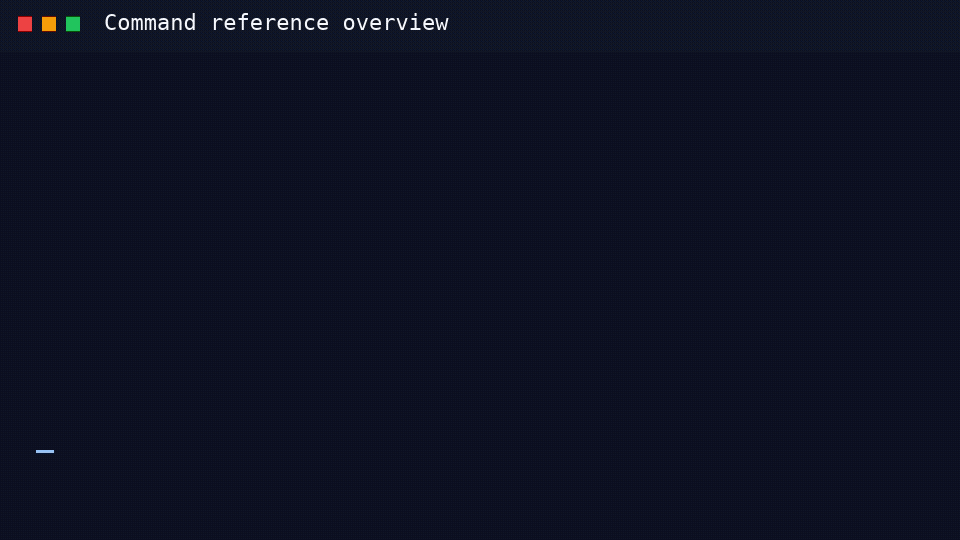

# Command Reference

Auto-generated reference for `gitlab-compliance` subcommands.

- [check](check.md)
- [generate](generate.md)
- [get-attributes](get-attributes.md)
- [policies](policies.md)
- [policies doc](policies-doc.md)
- [policies pull](policies-pull.md)
- [policies push](policies-push.md)
- [release-notes](release-notes.md)
