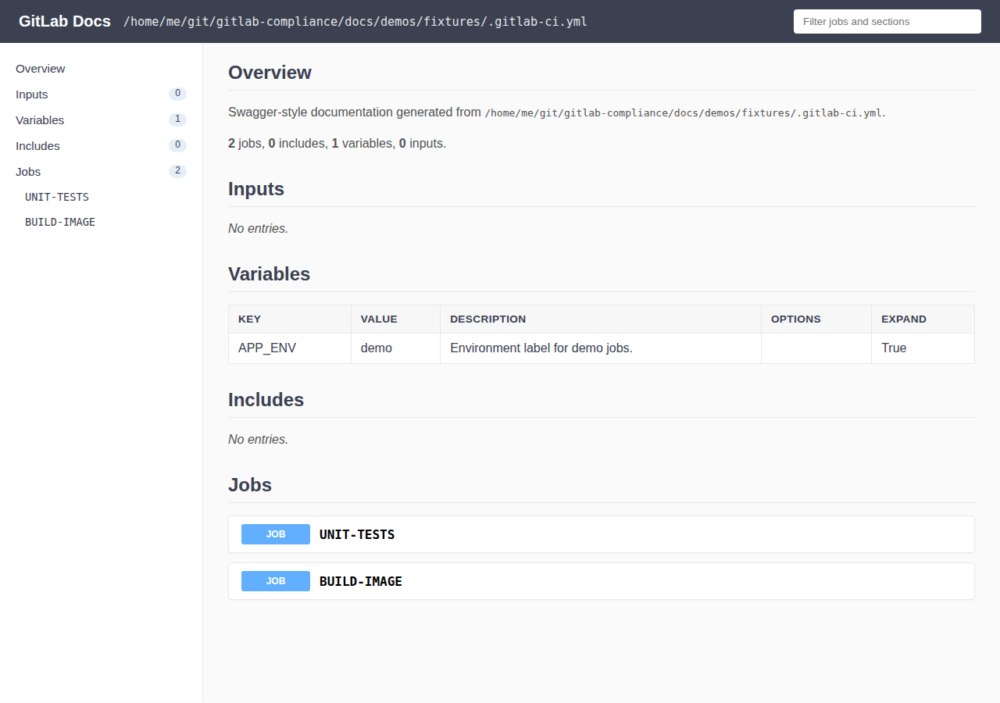

# generate

Will scan through your gitlab-ci yml and build documentation from the yml.

<!-- MANUAL DOCS:START -->

## See it in action


CLI writes the HTML file, then the rendered documentation:




## Option details

Use [`get-attributes`](get-attributes.md) when you need an **include whitelist**
of specific job attributes as a table; use `generate --exclude` for a
**blacklist** when building full pipeline documentation.

```bash
gitlab-compliance generate -i .gitlab-ci.yml \
  --exclude variables,workflow,image \
  --group-by stage \
  --format swagger-markdown
```

`--max-include-depth` matches `check` and `document gitstrings`: omit for
unlimited nesting; depth `0` is the root file.

<!-- MANUAL DOCS:END -->


## Usage

```
Usage: gitlab-compliance generate [OPTIONS]
```

## Options
* `detailed`:
  * Type: BOOL
  * Default: `false`
  * Usage: `--detailed`

  Will include workflow and rules from jobs.

* `output_format`:
  * Type: Choice(['markdown', 'swagger-markdown', 'html'])
  * Default: `markdown`
  * Usage: `--format
-f`

  Output format for generated documentation.

* `DRY_MODE`:
  * Type: BOOL
  * Default: `false`
  * Usage: `--dry-mode
-d`

  If set will disable documentation from being written

* `OUTPUT_FILE`:
  * Type: STRING
  * Default: `none`
  * Usage: `--output-file
-o`

  Output location of the generated documentation.

* `GLDOCS_CONFIG_FILE`:
  * Type: STRING
  * Default: `.gitlab-ci.yml`
  * Usage: `--input-config
-i`

  The Gitlab CI Input configuration file to generated documentation from.

* `exclude`:
  * Type: STRING
  * Default: `none`
  * Usage: `--exclude
-x`

  Comma-separated sections or job attributes to omit from output. Sections: inputs, variables, includes, workflow, jobs, container_images.

* `group_by`:
  * Type: STRING
  * Default: `none`
  * Usage: `--group-by
-g`

  Group jobs in the Jobs section by this job attribute (e.g. stage).

* `max_include_depth`:
  * Type: INT
  * Default: `none`
  * Usage: `--max-include-depth`

  Max local include nesting depth from the root file (omit for unlimited).

* `help`:
  * Type: BOOL
  * Default: `false`
  * Usage: `--help`

  Show this message and exit.


## CLI Help

```
Usage: gitlab-compliance generate [OPTIONS]

  Will scan through your gitlab-ci yml and build documentation from the yml.

Options:
  --detailed                      Will include workflow and rules from jobs.
  -f, --format [markdown|swagger-markdown|html]
                                  Output format for generated documentation.
  -d, --dry-mode                  If set will disable documentation from being
                                  written
  -o, --output-file TEXT          Output location of the generated
                                  documentation.
  -i, --input-config TEXT         The Gitlab CI Input configuration file to
                                  generated documentation from.
  -x, --exclude TEXT              Comma-separated sections or job attributes
                                  to omit from output. Sections: inputs,
                                  variables, includes, workflow, jobs,
                                  container_images.
  -g, --group-by TEXT             Group jobs in the Jobs section by this job
                                  attribute (e.g. stage).
  --max-include-depth INTEGER     Max local include nesting depth from the
                                  root file (omit for unlimited).
  --help                          Show this message and exit.
```
