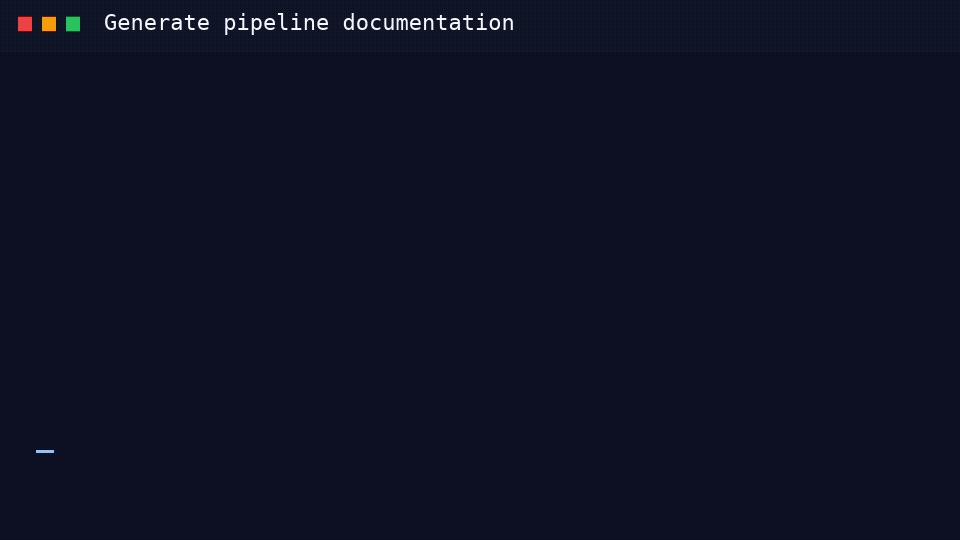

# generate

Generate pipeline documentation from GitLab CI YAML.

## Animated demo



## Output examples

The `generate` command writes pipeline documentation in Markdown,
swagger-markdown, or HTML formats.

```bash
gitlab-compliance generate -i .gitlab-ci.yml --format markdown -o GITLAB-COMPLIANCE.md
gitlab-compliance generate -i .gitlab-ci.yml --format html -o public/index.html
```

### Markdown output

```markdown
## GITLAB COMPLIANCE - .gitlab-ci.yml

## Inputs

| Key       | Value               | Description | Options   | Expand |
| --------- | ------------------- | ----------- | --------- | ------ |
| job-stage | {'default': 'test'} | _not set_   | _not set_ | true   |

## Variables

| Key         | Value          | Description | Options   | Expand |
| ----------- | -------------- | ----------- | --------- | ------ |
| APPLICATION | gitlab-docs    | _not set_   | _not set_ | true   |

## Jobs

### JOB - test

| Attribute | Value |
| --------- | ----- |
| stage     | test  |
```

### HTML output

```html
<!DOCTYPE html>
<html lang="en">
<head>
  <meta charset="utf-8">
  <meta name="viewport" content="width=device-width, initial-scale=1">
  <title>GitLab Docs - .gitlab-ci.yml</title>
</head>
<body>
  <header class="topbar">
    <h1>GitLab Docs</h1>
    <span class="config-file">.gitlab-ci.yml</span>
    <input class="search" id="search" type="search" placeholder="Filter jobs and sections">
  </header>
  <div class="layout">
    <nav class="sidebar">
      <a class="nav-link" href="#overview">Overview</a>
      <a class="nav-link" href="#jobs">Jobs<span class="nav-count">1</span></a>
    </nav>
    <main class="content">
      <section class="section" id="overview">
        <h2>Overview</h2>
        <p>Swagger-style documentation generated from <code>.gitlab-ci.yml</code>.</p>
      </section>
      <section class="section" id="jobs">
        <h2>Jobs</h2>
        <article class="opblock opblock-job" data-name="test" id="job-test">
          <button class="opblock-summary" type="button" aria-expanded="false">
            <span class="opblock-summary-method">JOB</span>
            <span class="opblock-summary-path">test</span>
          </button>
        </article>
      </section>
    </main>
  </div>
</body>
</html>
```

## Usage

```text
Usage: gitlab-compliance generate [OPTIONS]
```

## Options

| Parameter | Required | Type | Default | Usage | Description |
| --------- | -------- | ---- | ------- | ----- | ----------- |
| `detailed` | No | `boolean` | `False` | `--detailed` | Include workflow and rules from jobs. |
| `output_format` | No | `choice: markdown, swagger-markdown, html` | `markdown` | `--format, -f` | Output format for generated documentation. |
| `DRY_MODE` | No | `boolean` | `False` | `--dry-mode, -d` | Print planned output without writing documentation. |
| `OUTPUT_FILE` | No | `text` | `None` | `--output-file, -o` | Output location of the generated documentation. |
| `GLDOCS_CONFIG_FILE` | No | `text` | `.gitlab-ci.yml` | `--input-config, -i` | GitLab CI input configuration file to generate documentation from. |
| `exclude` | No | `text` | `None` | `--exclude, -x` | Comma-separated sections or job attributes to omit from output. Sections: `inputs`, `variables`, `includes`, `workflow`, `jobs`, `container_images`. |
| `group_by` | No | `text` | `None` | `--group-by, -g` | Group jobs in the Jobs section by this job attribute, for example `stage`. |
| `help` | No | `boolean` | `False` | `--help` | Show this message and exit. |

## CLI Help

```text
Usage: gitlab-compliance generate [OPTIONS]

  Generate pipeline documentation from GitLab CI YAML.

Options:
  --detailed                      Will include workflow and rules from jobs.
  -f, --format [markdown|swagger-markdown|html]
                                  Output format for generated documentation.
  -d, --dry-mode                  Print planned output without writing
                                  documentation.
  -o, --output-file TEXT          Output location of the generated
                                  documentation.
  -i, --input-config TEXT         GitLab CI input configuration file to generate
                                  documentation from.
  -x, --exclude TEXT              Comma-separated sections or job attributes
                                  to omit from output. Sections: inputs,
                                  variables, includes, workflow, jobs,
                                  container_images.
  -g, --group-by TEXT             Group jobs in the Jobs section by this job
                                  attribute (e.g. stage).
  --help                          Show this message and exit.
```
