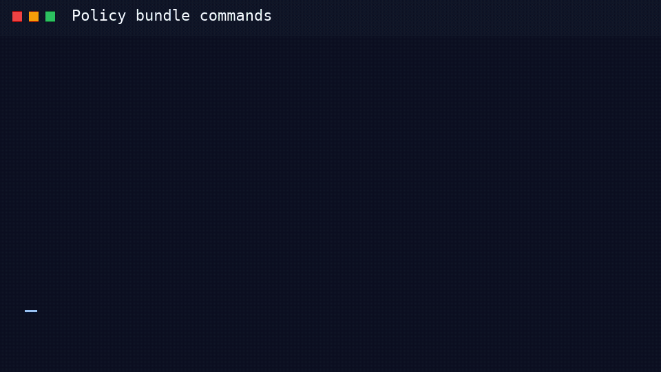

<!-- gitlab-compliance-command-reference-opening-auto-generated -->
# policies

Manage compliance policy bundles (catalog, OCI push/pull).

## Animated demo



## Usage

```text
Usage: gitlab-compliance policies [OPTIONS] COMMAND [ARGS]...
```

## Options

| Parameter | Required | Type | Default | Usage | Description |
| --------- | -------- | ---- | ------- | ----- | ----------- |
| `help` | No | `boolean` | `False` | `--help` | Show this message and exit. |

## CLI Help

```text
Usage: gitlab-compliance policies [OPTIONS] COMMAND [ARGS]...

  Manage compliance policy bundles (catalog, OCI push/pull).

Options:
  --help  Show this message and exit.

Commands:
  doc   Generate a searchable policy catalog from Conftest-style #...
  pull  Pull a compliance policy bundle from an OCI registry.
  push  Push a compliance policy bundle to an OCI registry (Conftest-style).
```
<!-- gitlab-compliance-command-reference-closing-auto-generated -->
